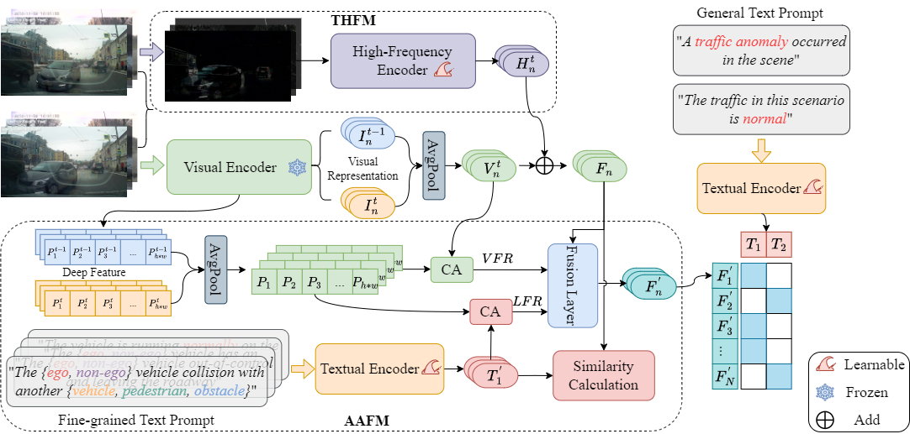

# TTHF
The code of [Text-Driven Traffic Anomaly Detection with Temporal High-Frequency Modeling in Driving Videos](https://ieeexplore.ieee.org/document/10504300)
Rongqin Liang, Yuanman Li, Jiantao Zhou, and Xia Li

Our TTHF framwork:



## Installation
### Dependencies
 - Python 3.8
 - pytorch 2.0.1
 - cuda 11.3
 - Ubuntu 20.04
 - RTX 3090
 - Please refer to the "requirements.txt" file for more details.

## Preparing
First, prepare the data for training or testing by:

```
cd TTHF/datasets
python ./extract_samples.sh
```
Note that you need to modify the corresponding path.

## Training
Users can train the TTHF models on DoTA dataset easily by runing the following command:

```
cd TTHF
python3 ./main.py \
        --train \
        --lr_clip 5e-6 \
        --wd 1e-4 \
        --epochs 15 \
        --batch_size 128 \
        --dataset DoTA \
        --gpu_num 0 \
        --height 224 \
        --width 224 \
        --normal_class 1 \
        --eval_every 1000 \
        --base_model 'RN50' \
        --general \
        --fg \
        --hf \
        --aafm \
        --other_method 'TDAFF_BASE' \
        --exp_name 'TDAFF_BASE_RN50'
```
Note that you need to modify the corresponding path.

## Inference 
Users can test the [TTHF models](https://www.alipan.com/s/5xfCZS1kCCc) (Extraction code: 65fv) on DoTA or DADA-2000 dataset easily by runing the following command:

For DoTA:
```
python3 ./main.py \
        --evaluate \
        --batch_size 128 \
        --dataset DoTA \
        --gpu_num 0 \
        --height 224 \
        --width 224 \
        --normal_class 1 \
        --eval_every 1000 \
        --base_model 'RN50' \
        --general \
        --fg \
        --hf \
        --aafm \
        --other_method 'TDAFF_BASE' \
        --exp_name 'TDAFF_BASE_RN50'
```

For DADA-2000:
```
python3 ./main.py \
        --evaluate \
        --batch_size 128 \
        --dataset DADA \
        --gpu_num 0 \
        --height 224 \
        --width 224 \
        --normal_class 1 \
        --eval_every 1000 \
        --base_model 'RN50' \
        --general \
        --fg \
        --hf \
        --aafm \
        --other_method 'TDAFF_BASE' \
        --exp_name 'TDAFF_BASE_RN50'
```
User can also see "tdaff_base_script.sh" for more training and testing commands.

Note that our project is developed based on the [code](https://github.com/openai/CLIP) of [Learning Transferable Visual Models From Natural Language Supervision](https://arxiv.org/abs/2103.00020). The relevant pre-trained models can be downloaded from the official website.

## Citation

If you found the repo is useful, please feel free to cite our papers:
```
@article{10504300,
    title={Text-Driven Traffic Anomaly Detection with Temporal High-Frequency Modeling in Driving Videos},
    author={Rongqin Liang and Yuanman Li and Jiantao Zhou and Xia Li},
    journal={IEEE Transactions on Circuits and Systems for Video Technology},
    year={2024},
    doi={10.1109/TCSVT.2024.3390173}
}

```
